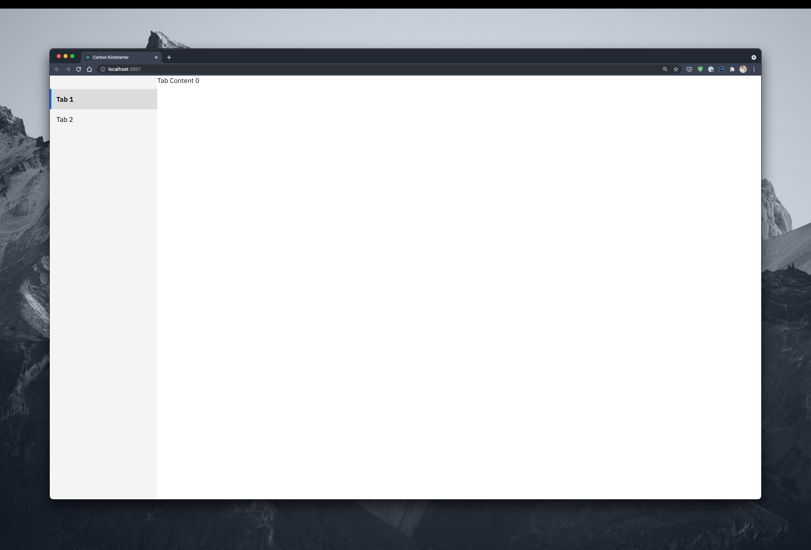

# Carbon Sidebar Tabs



# How To Use

Please take a look at [App.js](src/App.js) fir for full example and documentation.

To add new tabs add this item as a child to the `<SideNav>` component.

```javascript
<SideNavMenuItem
 onClick={(e) => changeTab(e)}
 tab={#} // tab #. Make sure this is a distinct number from other tabs.
>
 [tab title]
</SideNavMenuItem>
```

To add the content that is shown to the right of the sidebar, add the following as a child to the `div#tab-content-container`:

```javascript
<Tab
 className="tab-#" // This number must match the corresponding <SideNavMenuItem tab={#}> as mentioned above.
 title="title" // What is shown in the <TopHeader> component.
>
 <Content>
</Tab>
```
